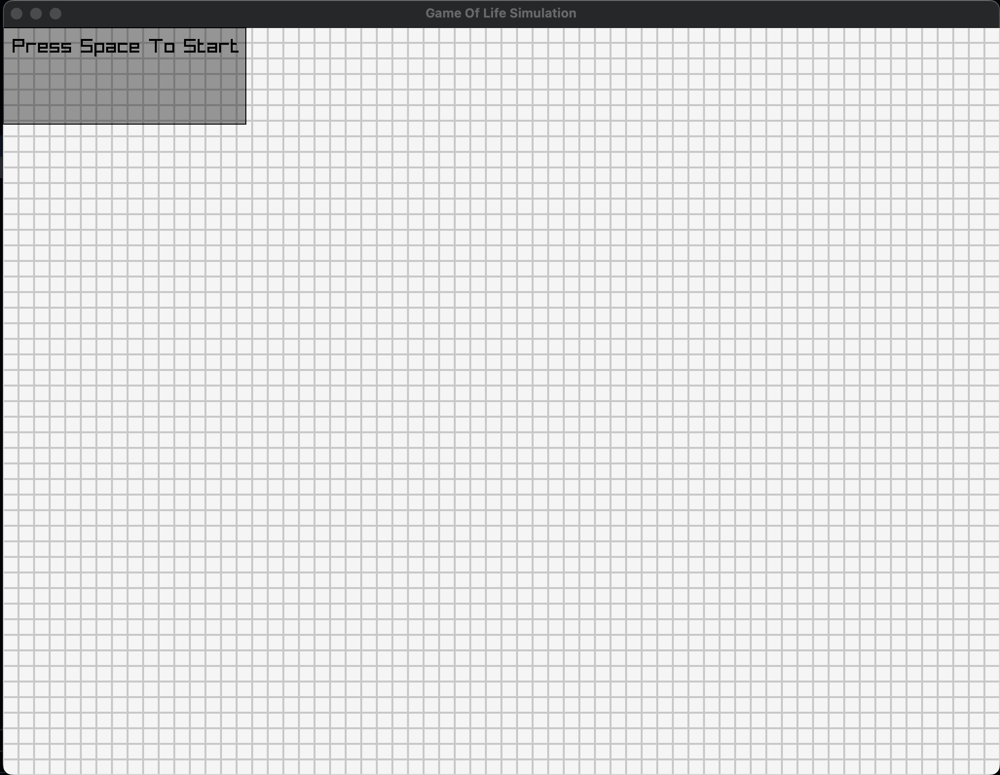

# A Conway's game of life implementation on raylib using C++

This is a simple implementation of Conway's game of life using raylib and C++. It is a simple project to get familiar with raylib and C++.

## Video

## How to run

1. Clone this repository using `git clone --recursive https://github.com/burakssen/gameoflife.git`
2. Install cmake and make sure it is in your PATH
3. Create a build directory and go into it
4. Run `cmake ..` and then `make`
5. Run `./gameoflife`

## Controls

1. Left click toggles cells
2. Space starts and stops the simulation
3. Up and down arrow keys increase and decrease the simulation speed
4. U key increases the grid size
5. D key decreases the grid size
6. Scroll wheel zooms in and out
7. Dragging Scroll wheel click outside of the screen moves the camera
